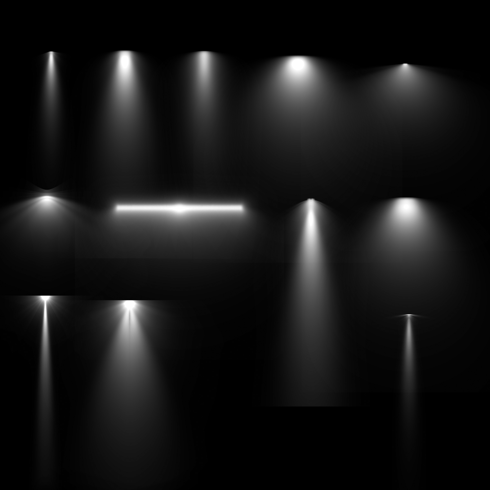

<div align="center">

# 🖌️ Photoshop Brushes by MasaraX 🖌️

</div>

<p align="center">
  A collection of custom Photoshop brushes to enhance your creative projects.
</p>

---

## 🚀 Getting Started

Welcome! This guide will walk you through downloading and installing the brushes in Adobe Photoshop.

### 📥 Downloading the Brushes

Choose the method that suits you best.

#### Method 1: Simple Download (for Beginners)

1.  Click the green **<> Code** button at the top-right of this page.
2.  Select **Download ZIP** from the dropdown menu.
3.  Save the `photoshop-brushes-main.zip` file to your computer.
4.  Unzip the downloaded file. A new folder named `photoshop-brushes-main` will be created.

#### Method 2: Command Line Download (for Advanced Users)

1.  Open your command prompt or terminal.
2.  Clone the repository using the following command:
    ```bash
    git clone https://github.com/masarax/photoshop-brushes.git
    ```
3.  This will create a `photoshop-brushes` folder containing all the files.

---

### 🎨 Step-by-Step Installation in Photoshop

After downloading the files using either method, follow these steps:

1.  Launch **Adobe Photoshop**.
2.  Select the **Brush Tool** (or press `B`).
3.  In the Brush Preset picker, click the **gear icon** ⚙️ in the top-right corner.
4.  Choose **Import Brushes...**.
5.  Navigate to the folder you downloaded (`photoshop-brushes-main` or `photoshop-brushes`), then open the `brushes` subfolder.
6.  Select a brush file (e.g., `MasaraX - Blood Brushes.abr`) and click **Load**.

<div align="center">

*Your new brushes are now ready to use!* ✨

</div>

---

## 🖌️ Available Brush Packs

<table>
  <tr>
    <td align="center">
      <a href="brushes/MasaraX%20-%20Blood%20Brushes.abr">
        
        <br>
        <sub><b>Blood Brushes</b></sub>
      </a>
    </td>
    <td align="center">
      <a href="brushes/MasaraX%20-%20Cloud%20Brushes.abr">
        
        <br>
        <sub><b>Cloud Brushes</b></sub>
      </a>
    </td>
  </tr>
  <tr>
    <td align="center">
      <a href="brushes/MasaraX%20-%20Fire%20Brushes.abr">
        
        <br>
        <sub><b>Fire Brushes</b></sub>
      </a>
    </td>
    <td align="center">
      <a href="brushes/MasaraX%20-%20Fireworks%20Brushes.abr">
        
        <br>
        <sub><b>Fireworks Brushes</b></sub>
      </a>
    </td>
  </tr>
  <tr>
    <td align="center">
      <a href="brushes/MasaraX%20-%20Lightning%20Bolt%20Brushes.abr">
        
        <br>
        <sub><b>Lightning Bolt Brushes</b></sub>
      </a>
    </td>
    <td align="center">
      <a href="brushes/MasaraX%20-%20Smoke%20Brushes.abr">
        
        <br>
        <sub><b>Smoke Brushes</b></sub>
      </a>
    </td>
  </tr>
  <tr>
    <td align="center">
      <a href="brushes/Brushpack-Lighting.abr">
        
        <br>
        <sub><b>Lighting Brushes</b></sub>
      </a>
    </td>
    <td align="center">
      <a href="brushes/MasaraX%20-%20Bubble%20Wrap%20Brushes.abr">
        
        <br>
        <sub><b>Bubble Wrap Brushes</b></sub>
      </a>
    </td>
  </tr>
  <tr>
    <td align="center">
      <a href="brushes/MasaraX%20-%20Coffee%20Stain%20Brushes.abr">
        
        <br>
        <sub><b>Coffee Stain Brushes</b></sub>
      </a>
    </td>
    <td align="center">
      <a href="brushes/MasaraX%20-%20Crayon%20Brushes.abr">
        
        <br>
        <sub><b>Crayon Brushes</b></sub>
      </a>
    </td>
  </tr>
  <tr>
    <td align="center">
      <a href="brushes/MasaraX%20-%20Drip%20Brushes.abr">
        
        <br>
        <sub><b>Drip Brushes</b></sub>
      </a>
    </td>
    <td align="center">
      <a href="brushes/MasaraX%20-%20Fingerprint%20Brushes.abr">
        
        <br>
        <sub><b>Fingerprint Brushes</b></sub>
      </a>
    </td>
  </tr>
  <tr>
    <td align="center">
      <a href="brushes/MasaraX%20-%20Fog%20Brushes.abr">
        
        <br>
        <sub><b>Fog Brushes</b></sub>
      </a>
    </td>
    <td align="center">
      <a href="brushes/MasaraX%20-%20Footprint%20Brushes.abr">
        
        <br>
        <sub><b>Footprint Brushes</b></sub>
      </a>
    </td>
  </tr>
  <tr>
    <td align="center">
      <a href="brushes/MasaraX%20-%20Glitch%20Brushes.abr">
        
        <br>
        <sub><b>Glitch Brushes</b></sub>
      </a>
    </td>
    <td align="center">
      <a href="brushes/MasaraX%20-%20Grunge%20Brushes.abr">
        
        <br>
        <sub><b>Grunge Brushes</b></sub>
      </a>
    </td>
  </tr>
  <tr>
    <td align="center">
      <a href="brushes/MasaraX%20-%20Grunge%20Frame%20Brushes.abr">
        
        <br>
        <sub><b>Grunge Frame Brushes</b></sub>
      </a>
    </td>
    <td align="center">
      <a href="brushes/MasaraX%20-%20Ink%20Brushes.abr">
        
        <br>
        <sub><b>Ink Brushes</b></sub>
      </a>
    </td>
  </tr>
  <tr>
    <td align="center">
      <a href="brushes/MasaraX%20-%20Lip%20Print%20Brushes.abr">
        
        <br>
        <sub><b>Lip Print Brushes</b></sub>
      </a>
    </td>
    <td align="center">
      <a href="brushes/MasaraX%20-%20Masking%20Tape%20Brushes.abr">
        
        <br>
        <sub><b>Masking Tape Brushes</b></sub>
      </a>
    </td>
  </tr>
  <tr>
    <td align="center">
      <a href="brushes/MasaraX%20-%20Noise%20Brushes.abr">
        
        <br>
        <sub><b>Noise Brushes</b></sub>
      </a>
    </td>
    <td align="center">
      <a href="brushes/MasaraX%20-%20Paint%20Stroke%20Brushes.abr">
        
        <br>
        <sub><b>Paint Stroke Brushes</b></sub>
      </a>
    </td>
  </tr>
  <tr>
    <td align="center">
      <a href="brushes/MasaraX%20-%20Plastic%20Wrap%20Brushes.abr">
        
        <br>
        <sub><b>Plastic Wrap Brushes</b></sub>
      </a>
    </td>
    <td align="center">
      <a href="brushes/MasaraX%20-%20Redaction%20Brushes.abr">
        
        <br>
        <sub><b>Redaction Brushes</b></sub>
      </a>
    </td>
  </tr>
  <tr>
    <td align="center">
      <a href="brushes/MasaraX%20-%20Scribble%20Brushes.abr">
        
        <br>
        <sub><b>Scribble Brushes</b></sub>
      </a>
    </td>
    <td align="center">
      <a href="brushes/MasaraX%20-%20Shadow%20Overlay%20Brushes.abr">
        
        <br>
        <sub><b>Shadow Overlay Brushes</b></sub>
      </a>
    </td>
  </tr>
  <tr>
    <td align="center">
      <a href="brushes/MasaraX%20-%20Snow%20Brushes.abr">
        
        <br>
        <sub><b>Snow Brushes</b></sub>
      </a>
    </td>
    <td align="center">
      <a href="brushes/MasaraX%20-%20Spider%20Web%20Brushes.abr">
        
        <br>
        <sub><b>Spider Web Brushes</b></sub>
      </a>
    </td>
  </tr>
  <tr>
    <td align="center">
      <a href="brushes/MasaraX%20-%20Splatter%20Brushes.abr">
        
        <br>
        <sub><b>Splatter Brushes</b></sub>
      </a>
    </td>
    <td align="center">
      <a href="brushes/MasaraX%20-%20Spray%20Paint%20Brushes.abr">
        
        <br>
        <sub><b>Spray Paint Brushes</b></sub>
      </a>
    </td>
  </tr>
  <tr>
    <td align="center">
      <a href="brushes/MasaraX%20-%20Stipple%20Brushes.abr">
        
        <br>
        <sub><b>Stipple Brushes</b></sub>
      </a>
    </td>
    <td align="center">
      <a href="brushes/MasaraX%20-%20Torn%20Paper%20Brushes.abr">
        
        <br>
        <sub><b>Torn Paper Brushes</b></sub>
      </a>
    </td>
  </tr>
  <tr>
    <td align="center">
      <a href="brushes/MasaraX%20-%20Transparent%20Tape%20Brushes.abr">
        
        <br>
        <sub><b>Transparent Tape Brushes</b></sub>
      </a>
    </td>
    <td align="center">
      <a href="brushes/MasaraX%20-%20Watercolor%20Brushes.abr">
        
        <br>
        <sub><b>Watercolor Brushes</b></sub>
      </a>
    </td>
  </tr>
  <tr>
    <td align="center">
      <a href="brushes/MasaraX%20-%20Ziplock%20Plastic%20Brushes.abr">
        
        <br>
        <sub><b>Ziplock Plastic Brushes</b></sub>
      </a>
    </td>
  </tr>
</table>

---

## 📄 License

This project is licensed under the MIT License. See the [LICENSE](LICENSE) file for details.
